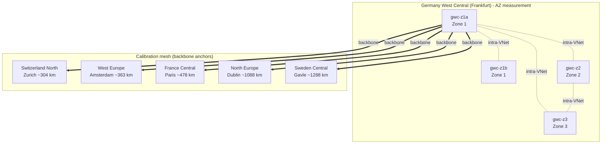

# Estimating the physical separation of Azure Availability Zones in Germany West Central

**A latency-based distance approximation, calibrated against known inter-region distances.**

This repository documents an ephemeral Azure lab that measured round-trip latency between
Availability Zones (AZs) in the **Germany West Central** region and used a calibrated
speed-of-light-in-fibre model to approximate how far apart those zones physically are.

Microsoft does not publish exact inter-AZ distances. The public commitment is only an
envelope: zones are separated far enough to avoid a shared failure domain (flood plain,
power grid, fire zone) yet close enough that synchronous replication stays viable, which
in practice means **less than roughly 100 km and under about 2 ms round-trip**. This lab
tightens that envelope with a measurement-backed estimate.

> **Result in one line:** the three distinct AZs in Germany West Central sit on the order
> of **10 to 20 km apart** (great-circle), riding fibre paths of **at most ~20 to 37 km**,
> comfortably inside Microsoft's published availability-zone envelope.

All confidential material (subscription and tenant identifiers, public IP addresses, SSH
keys) has been redacted. Private RFC1918 addresses are retained because they are not
sensitive.

---

## 1. Why latency can stand in for distance

Light in a single-mode fibre travels at roughly two thirds of its vacuum speed, because
the glass has a refractive index near 1.47. That gives a well-known rule of thumb:

- **~4.9 microseconds per km one-way**, or
- **~9.8 microseconds per km round-trip** (0.0098 ms/km).

Real fibre is never laid along the great-circle line between two points: it follows roads,
rail, and rights of way, so the physical cable is longer than the straight-line distance.
The ratio between the two is the **routing detour factor**, typically between 1.3x and
2.0x for terrestrial links.

If we measure latency between points whose true distance we already know, we can fit a
line and recover an **empirical slope** that already folds in both the fibre refractive
index and the average detour factor. We can then apply that slope to an unknown pair (two
AZs) and read off an approximate distance. The floors are the only thing that matters, so
every measurement uses the **minimum** RTT over thousands of pings, which strips out
queueing, scheduling jitter, and load.

---

## 2. Topology

The lab has two parts running in one resource group in Germany West Central:

1. A **calibration mesh** of single VMs in five nearby European Azure regions, used purely
   as distance anchors with known metro-to-metro great-circle distances.
2. The **AZ measurement set**: four VMs in Germany West Central, two of them pinned to the
   same physical zone (to establish a same-zone baseline) and one in each of the other two
   zones.




### VM inventory

| VM | Region | Zone | Role |
|----|--------|------|------|
| gwc-z1a | Germany West Central | 1 | AZ target + calibration source |
| gwc-z1b | Germany West Central | 1 | AZ target (same-zone baseline) |
| gwc-z2  | Germany West Central | 2 | AZ target |
| gwc-z3  | Germany West Central | 3 | AZ target |
| vm-chn  | Switzerland North (Zurich) | 1 | calibration anchor |
| vm-weu  | West Europe (Amsterdam) | - | calibration anchor |
| vm-frc  | France Central (Paris) | 1 | calibration anchor |
| vm-neu  | North Europe (Dublin) | - | calibration anchor |
| vm-sec  | Sweden Central (Gavle) | 1 | calibration anchor |

The Germany West Central VMs are Arm64 (`Standard_D2ps_v6`); the anchors are x64
(`Standard_D2s_v5` / `v4`). The CPU architecture difference is irrelevant to the result
because the calibration slope is derived from the x64 anchor pairs only, and the AZ
inference is anchored to its own same-zone Germany West Central baseline (same Arm64 SKU
on both ends). Two further anchors (Italy North, UK South) were planned but the
subscription was fully capacity-blocked for every available SKU in those regions, so they
were dropped. Five anchors and fifteen distinct region pairs are more than enough for a
stable fit.

---

## 3. Method

1. **Calibration ping.** Each anchor pings every other anchor (and Germany West Central)
   over the public backbone, 3000 ICMP echoes at 2 ms spacing, recording min/avg/max RTT.
2. **Collapse to pair floors.** For each unordered region pair, take the minimum RTT across
   both directions. That is the propagation floor over the Azure backbone.
3. **Fit.** Regress `min RTT` against the great-circle distance between the region metros
   (haversine). The slope is the empirical ms-per-km; the intercept absorbs fixed per-hop
   and stack overhead.
4. **AZ ping.** Inside Germany West Central, all four zone VMs ping each other over private
   IPs (intra-VNet, no NAT), same 3000-echo protocol.
5. **Baseline subtraction.** The same-zone pair (gwc-z1a to gwc-z1b) gives the floor that
   is *not* distance: switch fabric, host networking stack, hypervisor. Subtract it from
   each cross-zone pair to isolate the **propagation** component.
6. **Infer.** Divide each cross-zone propagation floor by the empirical slope to get an
   approximate great-circle distance, and by the theoretical straight-fibre slope to get
   an **upper bound** on the fibre path length.

Everything is reproducible from `scripts/measure.py` (collection) and `scripts/analyze.py`
(calibration + inference).

---

## 4. Calibration results

The backbone fit is strong: **R-squared = 0.95** across fifteen region pairs spanning 300
to 1600 km.


| Region pair | Great-circle (km) | Min RTT (ms) |
|-------------|------------------:|-------------:|
| Frankfurt - Zurich | 304 | 6.36 |
| Amsterdam - Frankfurt | 363 | 7.40 |
| Paris - Amsterdam | 430 | 9.17 |
| Paris - Frankfurt | 478 | 7.52 |
| Paris - Zurich | 488 | 13.42 |
| Amsterdam - Zurich | 613 | 14.06 |
| Amsterdam - Dublin | 757 | 14.80 |
| Paris - Dublin | 781 | 15.43 |
| Frankfurt - Dublin | 1088 | 23.00 |
| Amsterdam - Gavle | 1186 | 24.68 |
| Zurich - Dublin | 1239 | 28.44 |
| Frankfurt - Gavle | 1288 | 23.74 |
| Zurich - Gavle | 1579 | 30.67 |
| Paris - Gavle | 1613 | 35.23 |
| Gavle - Dublin | 1621 | 28.33 |

**Fitted slope: 19.3 microseconds per km RTT (0.0193 ms/km). Intercept: 1.0 ms.**

Compared with the theoretical straight-fibre round-trip figure of ~9.8 us/km, the recovered
slope implies an **average routing detour factor of about 1.97x**. In other words, Azure's
inter-region fibre paths in Europe are on average roughly twice the straight-line distance,
which is entirely consistent with published long-haul fibre geography (for example the
well-documented Frankfurt to London financial-trading routes run ~830 km of fibre for a
~640 km great-circle separation). The physics checks out: our independent measurement
recovers the speed of light in fibre to within the expected routing overhead.

---

## 5. Germany West Central inter-AZ estimate

Same-zone baseline (gwc-z1a to gwc-z1b, both in zone 1): **min RTT 0.160 ms.** This is the
non-distance floor.

| Zone pair | Min RTT (ms) | Propagation (ms) | Approx great-circle (km) | Fibre path upper bound (km) |
|-----------|-------------:|-----------------:|-------------------------:|----------------------------:|
| Zone 1 - Zone 3 | 0.363 | 0.203 | ~10 | <= 21 |
| Zone 1 - Zone 2 | 0.393 | 0.233 | ~12 | <= 24 |
| Zone 2 - Zone 3 | 0.519 | 0.359 | ~19 | <= 37 |

Reading the table:

- **Approx great-circle** applies the empirical backbone slope (which assumes the AZ fibre
  has the same ~2x detour as long-haul links). If metro AZ fibre is straighter than
  intercity fibre, the true straight-line distance would be a little larger than shown.
- **Fibre path upper bound** applies the theoretical straight-fibre slope, so it is the
  maximum possible cable length regardless of routing. This is the most defensible hard
  number: no pair can be more than ~20 to 37 km of fibre apart.

The picture is internally consistent: zones 1 and 3 are the closest, zones 2 and 3 the
farthest, and all three sit well within Microsoft's published availability-zone envelope
of under ~100 km. The propagation floors of 0.2 to 0.36 ms RTT also sit comfortably below
the ~2 ms round-trip synchronous-replication ceiling that the envelope implies.

---

## 6. Caveats and honest limits

This is an **approximation**, not a survey. Treat the numbers as order-of-magnitude
estimates with the following limits:

- **Detour factor is borrowed.** The 1.97x factor comes from intercity backbone links.
  Intra-metro AZ fibre may be more direct (pulling the great-circle estimate up) or may
  loop through a specific fibre meet-me point (pulling it down). The fibre-length upper
  bound does not depend on this assumption and is the safest figure to quote.
- **Zone-to-datacenter mapping is not fixed.** Azure logical zone numbers (1, 2, 3) are
  mapped per-subscription to physical zones, so "zone 2" in this subscription is not
  necessarily "zone 2" in yours. The *distances* between physical zones are what this lab
  measures; the labels are subscription-relative.
- **Same-zone baseline may still contain a little distance.** Two VMs in the same logical
  zone can land in different halls or buildings within that zone. The 0.16 ms baseline is
  therefore a slight over-subtraction at worst, which makes the AZ estimates conservative
  (biased low).
- **Metro coordinates are approximate.** Azure does not publish exact datacenter
  coordinates; the calibration uses representative metro centroids, which adds a few
  percent of noise to the slope.
- **ICMP is host-timestamped.** Kernel scheduling adds sub-microsecond noise, mitigated by
  taking the minimum over 3000 samples but never fully eliminated.

None of these move the conclusion: **the AZs are single-digit to low-tens of km apart**,
which is exactly what the availability-zone design intends.

---

## 7. Reproduce it

```bash
# 1. Deploy VMs across the calibration regions and the four GWC zones
#    (see scripts/cloud-init.yaml for the sockperf + ping bootstrap).
# 2. Collect latency (3000-echo min-RTT mesh, two sequential phases):
python scripts/measure.py        # writes raw-output/latency_raw.csv
# 3. Calibrate + infer:
python scripts/analyze.py        # writes raw-output/analysis.json
# 4. Render figures:
python scripts/plot.py           # diagrams/latency_vs_distance.png
python scripts/map.py            # diagrams/region_map.png
```

Public IP addresses in the scripts have been replaced with `PUBLIC_IP_REDACTED`; supply
your own VM addresses to re-run.

## Repository layout

```
.
├── README.md                     # this report
├── scripts/
│   ├── cloud-init.yaml           # VM bootstrap (sockperf, iputils-ping)
│   ├── measure.py                # min-RTT mesh collector (redacted IPs)
│   ├── analyze.py                # calibration + AZ distance inference
│   ├── plot.py                   # RTT-vs-distance regression figure
│   ├── map.py                    # geographic anchor map
│   └── sanitize.py               # secret-stripping pass
├── raw-output/
│   ├── latency_raw.csv           # per-pair min/avg/max RTT
│   ├── analysis.json             # fitted slope + inferred distances
│   └── vm-inventory.json         # VM names + private IPs (public IPs redacted)
└── diagrams/
    ├── topology.mmd              # Mermaid topology source
    ├── latency_vs_distance.png   # calibration regression
    └── region_map.png            # anchor geography
```

---

*Lab built with the azure-lab skill. Resources were ephemeral and deleted after
measurement. This report contains no subscription identifiers, tenant identifiers, public
IP addresses, or credentials.*
