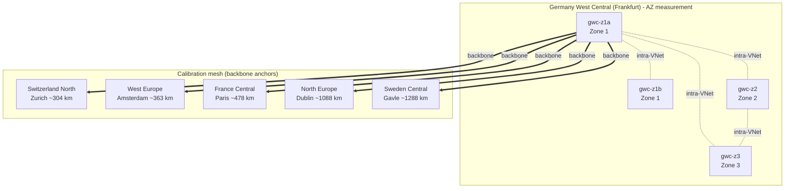
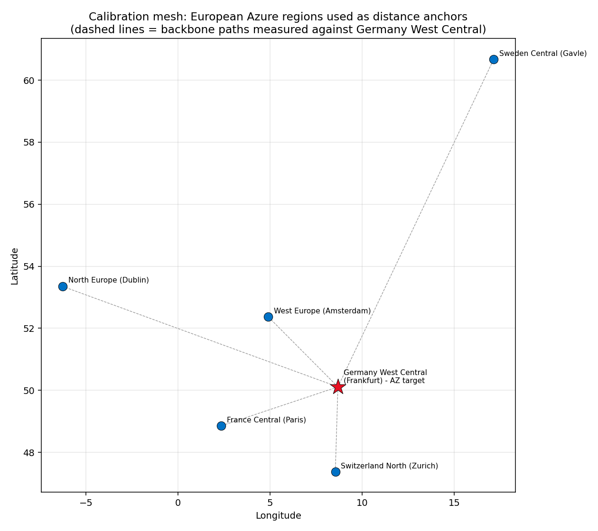
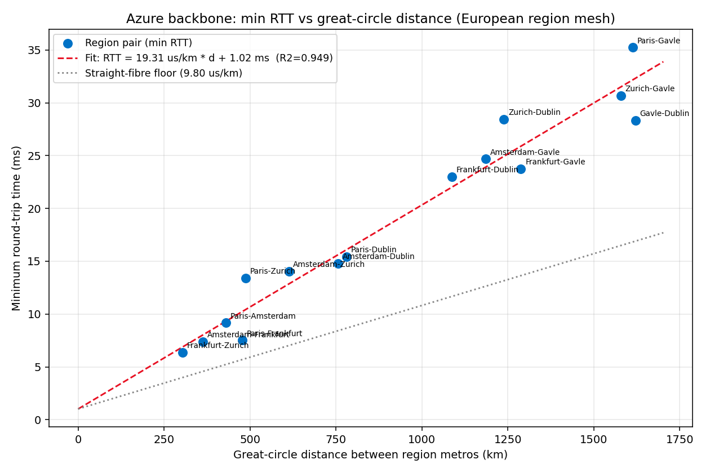
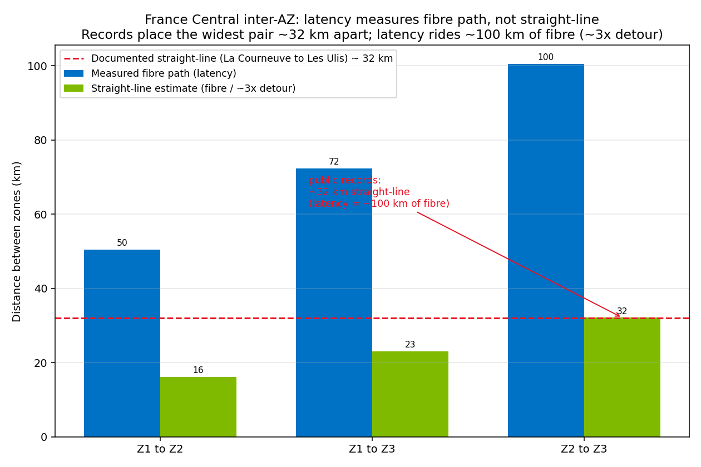

# Estimating the physical separation of Azure Availability Zones in Germany West Central

**A latency-based distance approximation, calibrated against known inter-region distances.**

This repository documents an ephemeral Azure lab that measured round-trip latency between
Availability Zones (AZs) in the **Germany West Central** region and used a calibrated
speed-of-light-in-fibre model to approximate how far apart those zones physically are.

Microsoft does not publish exact inter-AZ distances. The public commitment is only an
envelope: zones are separated far enough to avoid a shared failure domain (flood plain,
power grid, fire zone) yet close enough that synchronous replication stays viable, which
in practice means **less than roughly 100 km and under about 2 ms round-trip**. This lab
tightens that envelope with a measurement-backed estimate.

> **Result in one line:** the three distinct AZs in Germany West Central sit on roughly
> **21 to 37 km of fibre one way** (the hard, latency-derived numbers), which converts to a
> straight-line separation of about **7 to 19 km** depending on the routing-detour factor
> applied. Two independent detour factors bracket that range: **1.97x** derived from this
> lab's own backbone calibration (section 4), and **3.1x** derived from France Central's
> public datacenter-location records (section 7). Every number below is annotated with the
> source or formula it comes from. See sections 5 to 7.

All confidential material (subscription and tenant identifiers, public IP addresses, SSH
keys) has been redacted. Private RFC1918 addresses are retained because they are not
sensitive.

---

## 1. Why latency can stand in for distance

Light in a single-mode fibre travels at roughly two thirds of its vacuum speed, because
the glass has a refractive index near 1.47. That gives a well-known rule of thumb:

- **~4.9 microseconds per km one-way**, or
- **~9.8 microseconds per km round-trip** (0.0098 ms/km).

Real fibre is never laid along the great-circle line between two points: it follows roads,
rail, and rights of way, so the physical cable is longer than the straight-line distance.
The ratio between the two is the **routing detour factor**, typically between 1.3x and
2.0x for terrestrial links.

If we measure latency between points whose true distance we already know, we can fit a
line and recover an **empirical slope** that already folds in both the fibre refractive
index and the average detour factor. We can then apply that slope to an unknown pair (two
AZs) and read off an approximate distance. The floors are the only thing that matters, so
every measurement uses the **minimum** RTT over thousands of pings, which strips out
queueing, scheduling jitter, and load.

---

## 2. Topology

The lab has two parts running in one resource group in Germany West Central:

1. A **calibration mesh** of single VMs in five nearby European Azure regions, used purely
   as distance anchors with known metro-to-metro great-circle distances.
2. The **AZ measurement set**: four VMs in Germany West Central, two of them pinned to the
   same physical zone (to establish a same-zone baseline) and one in each of the other two
   zones.





### VM inventory

| VM | Region | Zone | Role |
|----|--------|------|------|
| gwc-z1a | Germany West Central | 1 | AZ target + calibration source |
| gwc-z1b | Germany West Central | 1 | AZ target (same-zone baseline) |
| gwc-z2  | Germany West Central | 2 | AZ target |
| gwc-z3  | Germany West Central | 3 | AZ target |
| vm-chn  | Switzerland North (Zurich) | 1 | calibration anchor |
| vm-weu  | West Europe (Amsterdam) | - | calibration anchor |
| vm-frc  | France Central (Paris) | 1 | calibration anchor |
| vm-neu  | North Europe (Dublin) | - | calibration anchor |
| vm-sec  | Sweden Central (Gavle) | 1 | calibration anchor |

The Germany West Central VMs are Arm64 (`Standard_D2ps_v6`); the anchors are x64
(`Standard_D2s_v5` / `v4`). The CPU architecture difference is irrelevant to the result
because the calibration slope is derived from the x64 anchor pairs only, and the AZ
inference is anchored to its own same-zone Germany West Central baseline (same Arm64 SKU
on both ends). Two further anchors (Italy North, UK South) were planned but the
subscription was fully capacity-blocked for every available SKU in those regions, so they
were dropped. Five anchors and fifteen distinct region pairs are more than enough for a
stable fit.

---

## 3. Method

1. **Calibration ping.** Each anchor pings every other anchor (and Germany West Central)
   over the public backbone, 3000 ICMP echoes at 2 ms spacing, recording min/avg/max RTT.
2. **Collapse to pair floors.** For each unordered region pair, take the minimum RTT across
   both directions. That is the propagation floor over the Azure backbone.
3. **Fit.** Regress `min RTT` against the great-circle distance between the region metros
   (haversine). The slope is the empirical ms-per-km; the intercept absorbs fixed per-hop
   and stack overhead.
4. **AZ ping.** Inside Germany West Central, all four zone VMs ping each other over private
   IPs (intra-VNet, no NAT), same 3000-echo protocol.
5. **Baseline subtraction.** The same-zone pair (gwc-z1a to gwc-z1b) gives the floor that
   is *not* distance: switch fabric, host networking stack, hypervisor. Subtract it from
   each cross-zone pair to isolate the **propagation** component.
6. **Infer.** Convert each cross-zone propagation floor to a **fibre-path length** by
   dividing by the speed of light in fibre (0.0098 ms/km RTT). Recovering the physical
   straight-line distance then requires dividing by a routing detour factor. This report
   applies **two independently derived detour factors** as a band: **1.97x** from the
   backbone calibration (section 4, formula: empirical slope / theoretical fibre slope) and
   **3.1x** from France Central public records (section 7, formula: measured fibre path /
   records-based straight-line distance).

Everything is reproducible from `scripts/measure.py` (collection) and `scripts/analyze.py`
(calibration + inference), with the France Central validation in `scripts/measure_frc.py`,
`scripts/measure_frc_supplement.py`, and `scripts/analyze_frc.py`.

---

## 4. Calibration results

The backbone fit is strong: **R-squared = 0.95** across fifteen region pairs spanning 300
to 1600 km.



| Region pair | Great-circle (km) | Min RTT (ms) |
|-------------|------------------:|-------------:|
| Frankfurt - Zurich | 304 | 6.36 |
| Amsterdam - Frankfurt | 363 | 7.40 |
| Paris - Amsterdam | 430 | 9.17 |
| Paris - Frankfurt | 478 | 7.52 |
| Paris - Zurich | 488 | 13.42 |
| Amsterdam - Zurich | 613 | 14.06 |
| Amsterdam - Dublin | 757 | 14.80 |
| Paris - Dublin | 781 | 15.43 |
| Frankfurt - Dublin | 1088 | 23.00 |
| Amsterdam - Gavle | 1186 | 24.68 |
| Zurich - Dublin | 1239 | 28.44 |
| Frankfurt - Gavle | 1288 | 23.74 |
| Zurich - Gavle | 1579 | 30.67 |
| Paris - Gavle | 1613 | 35.23 |
| Gavle - Dublin | 1621 | 28.33 |

**Fitted slope: 19.3 microseconds per km RTT (0.0193 ms/km). Intercept: 1.0 ms.**
(Source: least-squares regression over the 15 region pairs above; see `scripts/analyze.py`.)

The **backbone routing-detour factor** follows directly from that slope:

> **detour(backbone) = empirical slope / theoretical straight-fibre slope
> = 19.3 us/km / 9.8 us/km = 1.97x.**

Here 9.8 us/km RTT is the speed of light in single-mode fibre (section 1). In other words,
Azure's inter-region fibre paths in Europe are on average roughly twice the straight-line
distance, which is entirely consistent with published long-haul fibre geography (for example
the well-documented Frankfurt to London financial-trading routes run ~830 km of fibre for a
~640 km great-circle separation, a ~1.3x detour for a dedicated low-latency route; a mixed
backbone averaging ~2x is expected). The physics checks out: our independent measurement
recovers the speed of light in fibre to within the expected routing overhead. This 1.97x is
the more robust of the two detour factors used in this report because it rests on a 15-point
regression (R-squared 0.95), not a single pair.

---

## 5. Germany West Central inter-AZ estimate

Same-zone baseline (gwc-z1a to gwc-z1b, both in zone 1): **min RTT 0.160 ms**
(source: `scripts/measure.py` output, `raw-output/`). This is the non-distance floor
(switch fabric, host stack, hypervisor) that is subtracted from every cross-zone pair.

The chain of derivation for each pair, with the source or formula for every number:

- **Propagation (ms)** = min cross-zone RTT − 0.160 ms same-zone baseline
  (source: measured floors in `raw-output/`).
- **Fibre path (km)** = propagation (ms) / 0.0098 ms/km
  (formula: round-trip speed of light in single-mode fibre, section 1).
- **Straight-line (km)** = fibre path / detour factor, shown as a **band** between the two
  independently derived detours:
  - lower distance bound uses **detour 3.1x** (France Central metro records, section 7);
  - upper distance bound uses **detour 1.97x** (backbone regression, section 4).

| Zone pair | Propagation (ms) | Fibre path (km) | Straight-line, /3.1 (km) | Straight-line, /1.97 (km) |
|-----------|-----------------:|----------------:|-------------------------:|--------------------------:|
| Zone 1 - Zone 3 | 0.203 | ~21 | ~7  | ~11 |
| Zone 1 - Zone 2 | 0.233 | ~24 | ~8  | ~12 |
| Zone 2 - Zone 3 | 0.359 | ~37 | ~12 | ~19 |

Fibre paths are rounded from 0.203/0.0098 = 20.7, 0.233/0.0098 = 23.8, 0.359/0.0098 = 36.6.
Straight-line columns are those fibre paths divided by 3.1 and by 1.97 respectively.

**Reading the band.** The fibre paths (21/24/37 km) are the hard numbers: they depend only
on the measured propagation floors and a physical constant. The straight-line separation is
an estimate spanning roughly **7 to 11 km, 8 to 12 km, and 12 to 19 km** for the three
pairs. Because Germany West Central's AZs are believed to be **first-party Microsoft-owned
buildings** (section 7) that Microsoft can connect with its own point-to-point dark fibre,
their real detour is plausibly closer to the backbone 1.97x than to France Central's
provider-diverse 3.1x metro paths, biasing the true separation toward the **upper (/1.97)**
end of each band. That cannot be proven without GWC coordinates, so both bounds are shown.

The ordering is internally consistent (zones 1 and 3 closest, zones 2 and 3 farthest), and
even the fibre-path figures sit well within Microsoft's published availability-zone envelope
of under ~100 km, with propagation floors far below the ~2 ms round-trip
synchronous-replication ceiling.

---

## 6. France Central: measuring the widest pair

France Central is the better test region because, unlike Germany West Central, some of its
datacenter locations have leaked into public records (section 7), giving an external
ground truth. Its zones are known to be spread north and south of Paris.

Reaching all three France Central zones was constrained by per-subscription capacity: no
single small VM SKU was available in all three zones. The workaround used two SKU sets, each
carrying its own same-zone baseline, plus a mixed-architecture baseline measured directly
between an x64 and an Arm VM both pinned to zone 1:

- **Arm `D2ps_v6`** in zones 1 and 3 gives the zone 1 to zone 3 pair.
- **x64 `D2d_v4`** in zones 1 and 2 gives the zone 1 to zone 2 pair.
- The two zone-1 VMs of different architecture give the mixed-arch floor used for the zone 2
  to zone 3 pair (x64 `d-z2` to Arm `p-z3`, both reachable on the shared subnet).



| Zone pair | Propagation (ms) | Fibre path (km) | Straight-line, /3.1 (km) | Straight-line, /1.97 (km) | Baseline used |
|-----------|-----------------:|----------------:|-------------------------:|--------------------------:|---------------|
| Zone 1 - Zone 2 | 0.495 | ~50  | ~16 | ~25 | x64 same-zone (0.375 ms) |
| Zone 1 - Zone 3 | 0.709 | ~72  | ~23 | ~37 | Arm same-zone (0.153 ms) |
| Zone 2 - Zone 3 | 0.985 | **~100** | **~32** | ~51 | mixed-arch same-zone (0.366 ms) |

Fibre paths follow from propagation / 0.0098 ms/km (0.495/0.0098 = 50.5, 0.709/0.0098 = 72.3,
0.985/0.0098 = 100.5). Straight-line columns divide by 3.1 and 1.97 respectively. The **~32 km**
in the /3.1 column for the widest pair is not an estimate: it is the records-based ground
truth (section 7) that *defines* the 3.1x factor, so it appears here by construction.

These fibre-path lengths are robust: they follow directly from the propagation floors and the
speed of light in fibre. The widest pair (zone 2 to zone 3) rides **~100 km of fibre one
way**. The open question is how much of that 100 km is genuine physical separation versus
routing detour. That is exactly what the public location records in the next section pin
down, and the answer overturns an earlier, too-hasty reading of these numbers.

**A note on the "two campuses" claim.** The smallest France Central pair still rides ~50 km
of fibre (~16 to 25 km straight-line), nowhere near zero. If France Central really were
"three AZs over two campuses" (per the 2022 Journal du Net investigation), two of the three
zones would share a campus and that pair would collapse to roughly the same-zone baseline.
It does not. The data therefore points to **three genuinely separated sites**, implying
either a third France Central campus added after 2022 or an imprecision in the two-campus
reading. This matters for the 3.1x factor: it assumes the widest *measured* pair is the
La Courneuve to Les Ulis pair, and a third unmapped campus would undermine that assumption
(section 7 caveats).

---

## 7. Cross-check against public datacenter-location records

Microsoft never publishes datacenter coordinates, but the locations surface indirectly in
public records. The most useful sources, roughly in order of precision:

| Source | What it reveals |
|--------|-----------------|
| **PeeringDB** (`peeringdb.com/fac/...`) | GPS coordinates for named colocation facilities used as cloud on-ramps |
| **Journal du Net** investigation (June 2022) | Named the France Central AZ campuses: Digital Realty/Interxion at La Courneuve and a Microsoft-dedicated Colt building at Les Ulis |
| **French ICPE registry** (`georisques.gouv.fr`, `data.gouv.fr`) | Environmental permits for diesel backup generators (rubrique 2910), fuel storage (4718), cooling (1435) filed per commune with the prefecture and DREAL |
| **German BImSchG notices** (Regierungspräsidium Darmstadt; `bedburg.de`) | Immission-control permits for backup generators (4. BImSchV); confirmed a Microsoft filing at Bedburg (NRW) |
| **Grid / substation filings** (RTE in France, Westnetz/Amprion in Germany) | Named hyperscale power connections, e.g. a 520 MVA Westnetz upgrade for Microsoft's NRW cluster, 85 and 130 MW RTE contracts at Les Ulis |
| **Industry trackers** (DataCenterDynamics, Baxtel, dcpulse, datacentermap) | Municipality-level siting and press confirmation |

### What the records say for France Central

Two AZ campuses are documented (three AZs over two campuses, per Journal du Net):

- **La Courneuve** (north of Paris, Seine-Saint-Denis), Digital Realty/Interxion PAR7/PAR8,
  PeeringDB coordinates ~**48.931 N, 2.397 E**.
- **Les Ulis / Courtaboeuf** (south-west of Paris, Essonne), a Colt building described as
  100% dedicated to Microsoft, PeeringDB coordinates ~**48.675 N, 2.196 E**.

The great-circle distance between them is **32 km**
(source: haversine of the two PeeringDB coordinate pairs above, `scripts/analyze_frc.py`),
not 100 km.

### Reconciling 32 km (records) with 100 km (latency)

Both numbers are right; they measure different things. Latency measures the **fibre path**
(~100 km one way for the widest pair). The records give the **straight-line separation**
(~32 km). The ratio is the routing detour:

> **detour(metro, France Central) = 100 km fibre / 32 km straight-line ≈ 3.1x.**

Here 100 km is the widest-pair fibre path (section 6) and 32 km is the haversine of the two
PeeringDB campus coordinates above. In other words, Azure metro AZ links between north and
south Paris run about three times the straight-line distance in fibre, materially more
indirect than the 1.97x measured on the long-haul backbone (section 4). That is plausible for
provider-diverse metro paths that hairpin through central fibre hubs rather than running
point to point.

This corrects an earlier draft of this report, which assumed the ~100 km figure was itself
the straight-line distance and therefore concluded (wrongly) that AZ fibre runs almost
straight. The independent 32 km ground truth shows the opposite: **the latency method
measures the network path, and recovering physical distance requires dividing by a detour
factor.** Applying the 3.1x detour to the France Central fibre paths gives straight-line
estimates of roughly **16 km, 23 km, and 32 km** (the /3.1 column of section 6), with the
widest pair matching the documented 32 km by construction; applying the backbone 1.97x
instead gives **25 km, 37 km, and 51 km** (the /1.97 column). The true values lie in that
band, closest to the 3.1x end for the widest pair because that end is anchored to records.

Three honest caveats on this reconciliation:

- **Correspondence is assumed, not proven.** Logical zone numbers are subscription-relative,
  so I cannot prove my measured "zone 2 to zone 3" pair is the La Courneuve to Les Ulis pair.
  It is the natural match (both are the widest in their set), but it is an assumption.
- **The detour is a single calibration point.** One documented pair yields one detour ratio,
  with no error bar. The backbone 1.97x, by contrast, rests on a 15-pair regression.
- **A third France Central campus cannot be ruled out.** As section 6 notes, none of the
  three measured pairs collapses to the same-zone baseline, so all three zones appear
  separated. If a third campus exists (added after the 2022 investigation), the widest
  measured pair may not be La Courneuve to Les Ulis at all, which would invalidate the 3.1x
  derivation. Treat 3.1x as a plausible upper bound on the metro detour, not a fixed constant.

### What the records say for Germany West Central

Germany West Central's three current AZs are **first-party Microsoft-owned buildings** in the
Frankfurt metro, and unlike France Central's third-party colos they do **not** appear as named
facilities with published coordinates. A dedicated OSINT pass located exactly one candidate
of the three, at medium confidence, plus the network on-ramps (edge, not compute):

| Finding | Location / coordinates | Evidence & source | Confidence |
|---------|------------------------|-------------------|------------|
| **Candidate GWC compute site** | Hattersheim am Main, Voltastraße (Gewerbegebiet Süd), ~**50.063 N, 8.485 E**, ~12 km W of central Frankfurt | OpenStreetMap node 7431711009 tagged `name="Microsoft Azure Rechenzentrum: Deutschland, Westen-Mitte"` (via Nominatim/Overpass, the only Microsoft-named DC node in the Frankfurt bbox), independently corroborated by Wikimapia object #39142690 *"Microsoft Azure Datacenter (Germany West Central) - Hattersheim am Main"* | MEDIUM (two crowdsourced datasets agree on town + region label; not a primary source) |
| AZ 2 and AZ 3 | not located | no OSM/Wikimapia/permit evidence found for Kelsterbach, Bad Vilbel, Offenbach, Mörfelden-Walldorf, etc. | SPECULATIVE |
| Microsoft on-ramp (edge, **not** compute) | Interxion/Digital Realty FRA1-27, Hanauer Landstr. 298, **50.119 N, 8.735 E** | PeeringDB `fac/58` + `netfac?net_id=694` (Microsoft AS8075 present) | HIGH (but peering point, not the datacenter) |
| Microsoft on-ramp (edge, **not** compute) | Equinix FR7, Gutleutstr. 310, **50.097 N, 8.644 E** | PeeringDB `fac/74` + AS8075 netfac record (created 2019-09-06, matches region GA) | HIGH (but peering point, not the datacenter) |
| Region = Frankfurt metro | Frankfurt am Main | Microsoft News DE: *"...Erweiterung der Rechenzentrumsregion Deutschland, Westen-Mitte in Frankfurt am Main..."* | HIGH (metro only, no address) |

Distances from the one located candidate, for context (haversine on the coordinates above):
Hattersheim to Equinix FR7 ≈ **12 km**; Hattersheim to Interxion FRA ≈ **19 km**. A compute
site ~12 km west of the Frankfurt fibre core is **consistent** with the latency-derived
inter-zone spacing (~7 to 19 km straight-line, section 5), but with only one of three zones
located it **cannot confirm** the inter-AZ figures. The other two AZs remain unverified, so
the 21/24/37 km fibre paths still cannot be checked externally.

Note that the large Microsoft cluster under construction in North Rhine-Westphalia (Bergheim,
Bedburg, Elsdorf, ~7 km apart, ~170 km from Frankfurt) is a **separate future build**, not the
current Germany West Central AZs, and must not be conflated with them.

---

## 8. Caveats and honest limits

This is an **approximation**, not a survey. Treat the numbers as order-of-magnitude
estimates with the following limits:

- **Latency measures fibre path, not straight-line distance.** Converting between them needs
  a detour factor. This report brackets it between **1.97x** (backbone regression, 15 pairs,
  section 4) and **3.1x** (France Central metro records, one pair, section 7). Straight-line
  figures are shown as a band, not a single value.

- **The two detour factors disagree, and that gap is real, not noise.** The backbone 1.97x is
  statistically robust but is a long-haul average; the metro 3.1x is region-appropriate but
  rests on a single pair whose zone-correspondence is assumed and whose "widest pair" identity
  is threatened by a possible third France Central campus (section 6). Metro links plausibly
  detour more than the backbone, but first-party dark fibre between Microsoft-owned buildings
  could detour less; the truth for Germany West Central is unmeasured.
- **Zone-to-datacenter mapping is not fixed.** Azure logical zone numbers (1, 2, 3) are
  mapped per-subscription to physical zones, so "zone 2" in this subscription is not
  necessarily "zone 2" in yours. The *distances* between physical zones are what this lab
  measures; the labels are subscription-relative.
- **Same-zone baseline may still contain a little distance.** Two VMs in the same logical
  zone can land in different halls or buildings within that zone. The 0.16 ms baseline is
  therefore a slight over-subtraction at worst, which makes the AZ estimates conservative
  (biased low).
- **Metro coordinates are approximate.** Azure does not publish exact datacenter
  coordinates; the calibration uses representative metro centroids, which adds a few
  percent of noise to the slope. The one located GWC candidate (Hattersheim) rests on
  crowdsourced OSM/Wikimapia data, not a primary source.
- **ICMP is host-timestamped.** Kernel scheduling adds sub-microsecond noise, mitigated by
  taking the minimum over 3000 samples but never fully eliminated.

The headline result: the Germany West Central AZs sit on roughly **21 to 37 km of fibre**
(the hard, latency-derived numbers), which converts to a straight-line separation of about
**7 to 19 km** across the 3.1x-to-1.97x detour band, likely toward the wider end given the
region's probable first-party dark fibre. In France Central the widest pair rides ~100 km of
fibre that reconciles with a documented ~32 km straight-line separation between the
La Courneuve and Les Ulis campuses (detour 3.1x).

---

## 9. Reproduce it

```bash
# 1. Deploy VMs across the calibration regions and the four GWC zones
#    (see scripts/cloud-init.yaml for the sockperf + ping bootstrap).
# 2. Collect latency (3000-echo min-RTT mesh, two sequential phases):
python scripts/measure.py        # writes raw-output/latency_raw.csv
# 3. Calibrate + infer GWC AZ distances:
python scripts/analyze.py        # writes raw-output/analysis.json
# 4. Render figures:
python scripts/plot.py           # diagrams/latency_vs_distance.png
python scripts/map.py            # diagrams/region_map.png
# 5. France Central validation (known ~100 km pair):
python scripts/measure_frc.py             # writes raw-output/latency_frc_raw.csv
python scripts/measure_frc_supplement.py  # adds the zone2<->zone3 + mixed baseline
python scripts/analyze_frc.py             # writes raw-output/analysis_frc.json
python scripts/plot_frc.py                # diagrams/frc_validation.png
```

Public IP addresses in the scripts have been replaced with `PUBLIC_IP_REDACTED`; supply
your own VM addresses to re-run.

## Repository layout

```
.
├── README.md                     # this report
├── scripts/
│   ├── cloud-init.yaml           # VM bootstrap (sockperf, iputils-ping)
│   ├── measure.py                # GWC + backbone min-RTT mesh collector
│   ├── analyze.py                # calibration + GWC AZ distance inference
│   ├── measure_frc.py            # France Central AZ mesh (two SKU sets)
│   ├── measure_frc_supplement.py # France Central zone2<->zone3 + mixed baseline
│   ├── analyze_frc.py            # France Central inference + ground-truth check
│   ├── plot.py                   # RTT-vs-distance regression figure
│   ├── plot_frc.py               # France Central validation figure
│   ├── map.py                    # geographic anchor map
│   └── sanitize.py               # secret-stripping pass
├── raw-output/
│   ├── latency_raw.csv           # GWC + backbone per-pair min/avg/max RTT
│   ├── analysis.json             # fitted slope + GWC inferred distances
│   ├── latency_frc_raw.csv       # France Central per-pair min/avg/max RTT
│   ├── analysis_frc.json         # France Central inference + validation
│   └── vm-inventory.json         # VM names + private IPs (public IPs redacted)
└── diagrams/
    ├── topology.mmd              # Mermaid topology source
    ├── latency_vs_distance.png   # calibration regression
    ├── region_map.png            # anchor geography
    └── frc_validation.png        # France Central two-model vs ground truth
```

---

*Lab built with the azure-lab skill. Resources were ephemeral and deleted after
measurement. This report contains no subscription identifiers, tenant identifiers, public
IP addresses, or credentials.*
